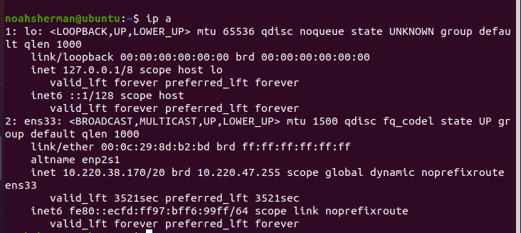
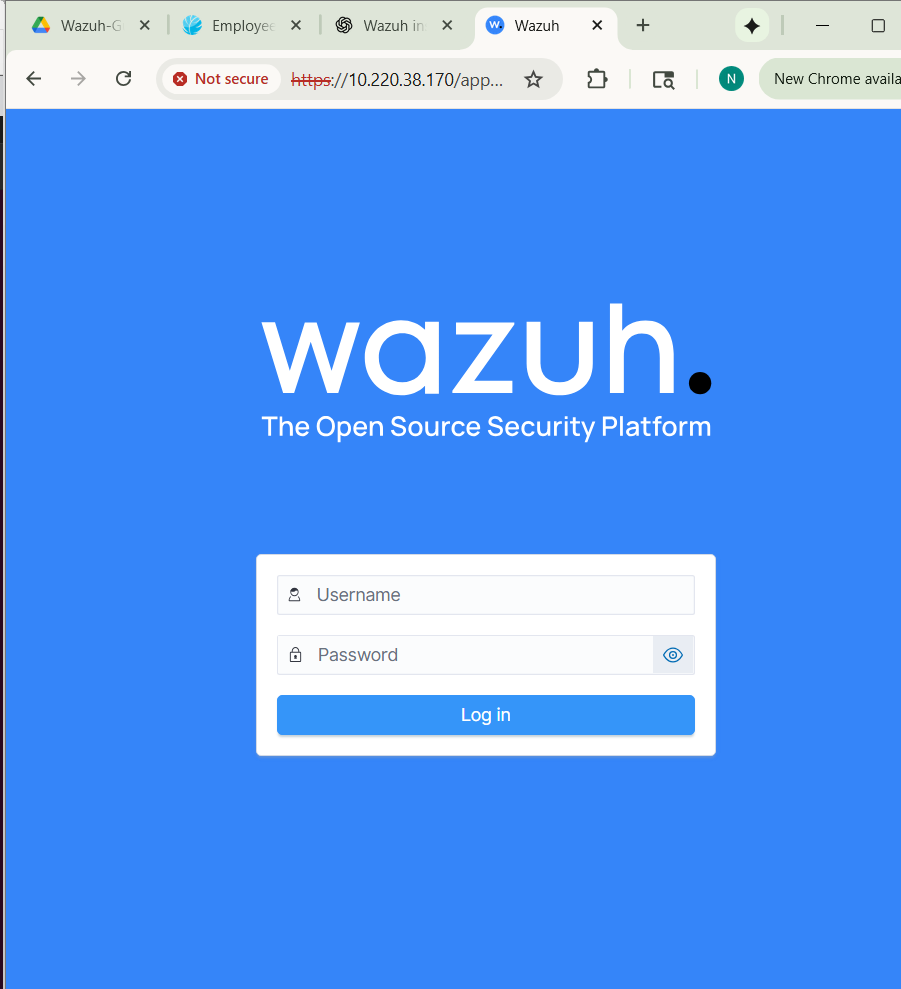
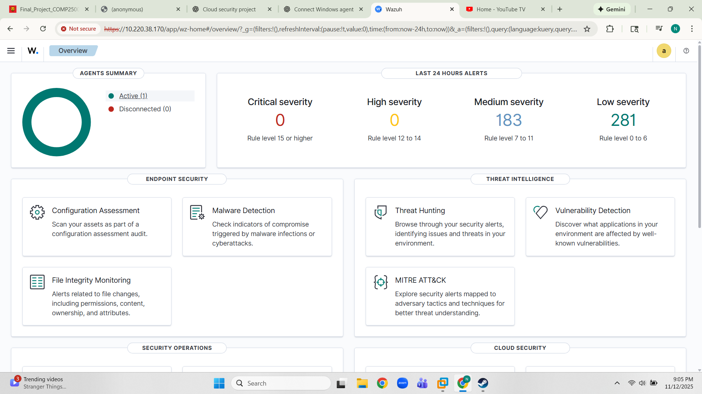
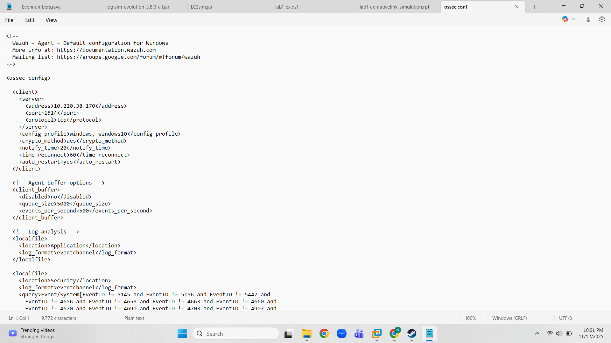
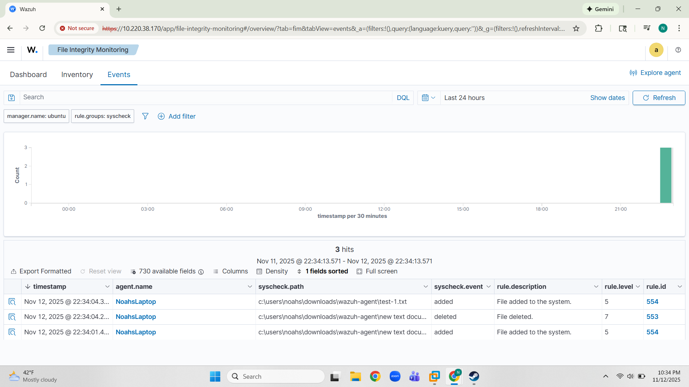

# Wazuh Home Lab — SIEM & File Integrity Monitoring

This repository documents my hands-on Wazuh lab, where I deployed a Wazuh Manager on Ubuntu and connected a Windows Agent to test log collection and File Integrity Monitoring (FIM).

## 🔌 Network Configuration

  
*Figure — Windows host IPv4 information used to confirm network connectivity to the Wazuh manager.*

  
*Figure — Ubuntu Wazuh manager server showing its bridged network IP (`ip a`) for dashboard and agent communication.*

## 🛠️ Wazuh Manager Installation (Ubuntu)

  
*Figure — Wazuh manager, Filebeat, and dashboard successfully installed on Ubuntu. The script displays the auto-generated admin credentials and confirms the dashboard is accessible over HTTPS.*

## Wazuh Dashboard Access

  
*Figure — Accessing the Wazuh dashboard through the Ubuntu server’s IP over HTTPS. The login page loads successfully despite the self-signed certificate warning.*

## Registering the Windows Agent

  
*Figure — Adding the Windows agent in the Wazuh manager using `manage_agents`, assigning it the host’s IP (`10.220.32.200`).*

  
*Figure — Extracting the agent key on Ubuntu and importing it into the Windows Wazuh Agent GUI to establish trust and link it to the manager.*

  
*Figure — Restarting the Windows Wazuh Agent after importing the authentication key so it can register with the Wazuh manager.*

## Agent Verification in Wazuh Dashboard

  
*Figure — Extracting the authentication key for Agent 001 (`Windows-Agent`) using `manage_agents` and confirming it is registered on the manager.*

  
*Figure — Wazuh dashboard overview showing one active agent and listing available security modules such as FIM, malware detection, and vulnerability detection.*

  
*Figure — Windows host successfully onboarded to Wazuh Manager. The agent appears as active with IP `10.220.32.200` and OS `Windows 11 Pro`.*

## Configuring File Integrity Monitoring (FIM)

  
*Figure — Viewing the default `ossec.conf` on the Windows agent before adding custom File Integrity Monitoring directories.*

![FIM dashboard showing no results yet] (assets/Wazuh-FIM-No-Results.png)  
*Figure — Wazuh File Integrity Monitoring dashboard initially showing no events before monitoring paths were added and changes were made.*

  
*Figure — Adding a custom realtime monitoring directory to `ossec.conf` (`C:\Users\noahs\Downloads\Wazuh-Agent`), enabling Wazuh to detect file creations, modifications, and deletions in that folder.*

## File Integrity Monitoring Events

  
*Figure — Wazuh File Integrity Monitoring dashboard showing real-time events generated from the monitored Windows directory. File creation and deletion events from `C:\Users\noahs\Downloads\wazuh-agent` were successfully detected.*

  
*Figure — Detailed Wazuh alert for a file-creation event (`syscheck_new_entry`). The Windows agent detected the new file `test-1.txt` and reported the change to the manager in real time.*

  
*Figure — Detailed Wazuh alert for a file-deletion event (`syscheck_deleted`). The removal of `test-1.txt` triggered a real-time alert showing the entry marked as `deleted` in the full_log.*
